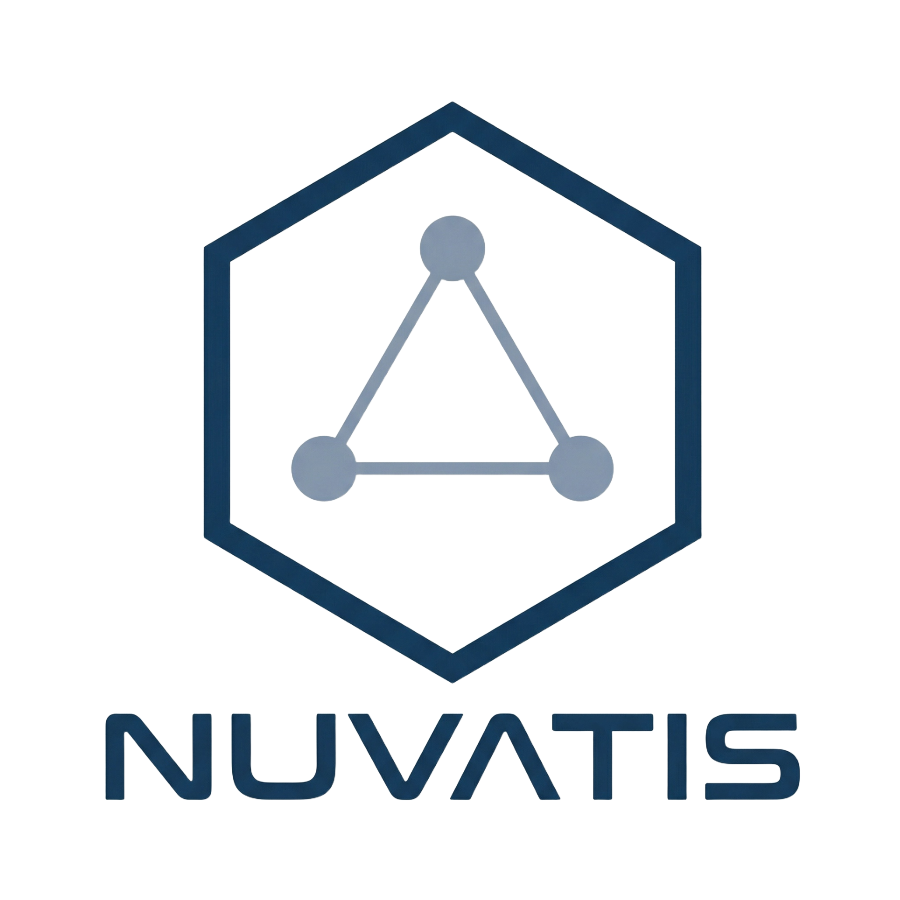

<p align="center">
  
</p>

<p align="right">
  <a href="README.md">한국어</a> | <a href="README.en.md">English</a>
</p>

# NuVatis

[](https://github.com/JinHo-von-Choi/nuvatis/actions/workflows/ci.yml)
[](https://www.nuget.org/packages/NuVatis.Core)
[](https://opensource.org/licenses/MIT)

MyBatis-style SQL Mapper for .NET, powered by Roslyn Source Generators.

## Overview

NuVatis is a SQL Mapper framework that simultaneously addresses the performance overhead of Entity Framework and the maintainability issues of inline SQL.

- SQL is managed separately via XML or C# Attributes
- Roslyn Source Generator automatically generates mapping code at build time
- Zero runtime reflection, Native AOT compatible (.NET 8+)
- ADO.NET-based minimal abstraction, maximum performance
- Multi-targeting: .NET 7 / 8 / 9 / 10
- Runtime validation of `${}` string substitution via `SqlIdentifier` type (SQL Injection defense)

## When NOT to Use NuVatis

NuVatis is not the right fit for every situation. Use the table below to choose the right tool.

**When EF Core is a better fit:**

| Case | Reason |
|------|--------|
| Dynamically combining 5+ optional filters | EF Core's IQueryable chaining is overwhelmingly convenient |
| Simple CRUD with no complex queries | EF Core + Repository pattern is sufficient |
| Team has no SQL experts | EF Core's automatic query generation is safer |
| Code-first migrations are central to your workflow | EF Core Migrations handles this natively |

**When Dapper is a better fit:**

| Case | Reason |
|------|--------|
| Few queries and XML management feels like overhead | Dapper lets you write inline SQL directly |
| Minimal library footprint desired | Dapper provides single-file-level simplicity |

**Where NuVatis excels:**

| Case | Reason |
|------|--------|
| Java MyBatis experience porting to .NET | XML mapper syntax is identical |
| Managing hundreds of legacy SQL statements as-is | Separates SQL from code for version control |
| Heavy dynamic SQL but type safety required | `<if>`/`<where>`/`<foreach>` + NV004 compile errors |
| Complex JOIN + aggregate queries requiring full control | SQL changes are reflected immediately |
| Native AOT environments | Source Generator produces reflection-free code |

> **TL;DR**: Use EF Core for dynamic query composition; use NuVatis for managing complex static SQL.
> Hybrid patterns combining both in the same project are supported.
> → [EF Core + NuVatis Hybrid Guide](docs/cookbook/hybrid-efcore-nuvatis.md)

## Packages

| Package | Description |
|---------|-------------|
| `NuVatis.Core` | Core runtime (Session, Executor, Transaction, Mapping, Cache) |
| `NuVatis.Generators` | Roslyn Source Generator (XML parsing, analysis, code generation) |
| `NuVatis.PostgreSql` | PostgreSQL Provider (Npgsql) |
| `NuVatis.MySql` | MySQL/MariaDB Provider (MySqlConnector) |
| `NuVatis.SqlServer` | SQL Server Provider (Microsoft.Data.SqlClient) |
| `NuVatis.Sqlite` | SQLite Provider (Microsoft.Data.Sqlite) |
| `NuVatis.Extensions.DependencyInjection` | Microsoft DI integration + Health Check |
| `NuVatis.Extensions.OpenTelemetry` | OpenTelemetry distributed tracing (ActivitySource) |
| `NuVatis.Extensions.EntityFrameworkCore` | EF Core DbContext connection/transaction sharing |
| `NuVatis.Extensions.Aspire` | .NET Aspire integration (Health Check + OTel auto-configuration) |
| `NuVatis.Testing` | Test support (InMemorySqlSession, QueryCapture) |

## Quick Start

### Installation

```bash
dotnet add package NuVatis.Core
dotnet add package NuVatis.Generators
dotnet add package NuVatis.PostgreSql
dotnet add package NuVatis.Extensions.DependencyInjection
```

### Mapper Interface

```csharp
public interface IUserMapper {
    User? GetById(int id);
    Task<User?> GetByIdAsync(int id, CancellationToken ct = default);
    IList<User> Search(UserSearchParam param);
    int Insert(User user);
    int Update(User user);
    int Delete(int id);
}
```

### XML Mapper

```xml
<?xml version="1.0" encoding="utf-8" ?>
<mapper namespace="Sample.Mappers.IUserMapper">

  <cache eviction="LRU" flushInterval="600000" size="512" />

  <resultMap id="UserResult" type="User">
    <id column="id" property="Id" />
    <result column="user_name" property="UserName" />
    <result column="email" property="Email" />
  </resultMap>

  <select id="GetById" resultMap="UserResult">
    SELECT id, user_name, email FROM users WHERE id = #{Id}
  </select>

  <select id="Search" resultMap="UserResult">
    SELECT id, user_name, email FROM users
    <where>
      <if test="UserName != null">
        AND user_name LIKE #{UserName}
      </if>
      <foreach collection="Ids" item="id"
               open="AND id IN (" separator="," close=")">
        #{id}
      </foreach>
    </where>
  </select>

  <insert id="Insert">
    INSERT INTO users (user_name, email) VALUES (#{UserName}, #{Email})
  </insert>

</mapper>
```

### C# Attribute (Static SQL)

```csharp
public interface IUserMapper {
    [Select("SELECT id, user_name, email FROM users WHERE id = #{Id}")]
    [ResultMap("UserResult")]
    User? GetById(int id);

    [Insert("INSERT INTO users (user_name, email) VALUES (#{UserName}, #{Email})")]
    int Insert(User user);
}
```

### DI Integration (ASP.NET Core)

```csharp
builder.Services.AddNuVatis(options => {
    options.ConnectionString = builder.Configuration.GetConnectionString("Default");
    options.Provider         = new PostgreSqlProvider();
    options.RegisterMappers(NuVatisMapperRegistry.RegisterAll);
    options.RegisterAttributeStatements(NuVatisMapperRegistry.RegisterAttributeStatements);
});

builder.Services.AddHealthChecks().AddNuVatis();
```

### Usage

```csharp
public class UserService {
    private readonly IUserMapper _mapper;

    public UserService(IUserMapper mapper) {
        _mapper = mapper;
    }

    public async Task<User?> GetUser(int id) {
        return await _mapper.GetByIdAsync(id);
    }
}
```

### Manual Session (Non-DI)

```csharp
using var session = factory.OpenSession();
var mapper = session.GetMapper<IUserMapper>();

var user = mapper.GetById(1);
mapper.Insert(newUser);
session.Commit();
```

## Sample Repository

A fully working example with performance benchmarks is available in a separate repository.

**[github.com/JinHo-von-Choi/nuvatis-sample](https://github.com/JinHo-von-Choi/nuvatis-sample)**

### Contents

| Directory | Description |
|-----------|-------------|
| `src/NuVatis.Sample.Core/` | Entities, mapper interfaces, XML mappers (with detailed comments) |
| `src/NuVatis.Sample.WebApi/` | ASP.NET Core Web API + Swagger UI |
| `src/NuVatis.Sample.Console/` | Console application example |
| `benchmarks/` | NuVatis vs Dapper vs EF Core comparison benchmarks |
| `database/` | PostgreSQL schema |

### Features Covered

- XML mapper dynamic SQL (`<if>`, `<foreach>`, `<where>`, `<choose>`)
- Association (1:1) / Collection (1:N) / nested mapping
- Atomic inventory update (concurrency control pattern)
- RESTful API integration (Users / Products / Orders)
- Large-scale benchmarks (18 scenarios)

### Quick Start (Docker required)

```bash
git clone https://github.com/JinHo-von-Choi/nuvatis-sample
cd nuvatis-sample
docker-compose up -d   # Start PostgreSQL
dotnet build
dotnet run --project src/NuVatis.Sample.WebApi
```

## Session Lifecycle

| Environment | Registration | Lifecycle |
|-------------|-------------|-----------|
| ASP.NET Core (DI) | Scoped | Per HTTP request |
| Generic Host (DI) | Scoped | Per scope |
| Console/Batch | Manual | using block |

- `autoCommit: false` (default) — MyBatis-compatible. Dispose without Commit triggers automatic Rollback.
- `autoCommit: true` — Commits immediately after each query.
- Lazy Connection — DB connection is established on the first query.

## Transaction Management

```csharp
using var session = factory.OpenSession();
var mapper = session.GetMapper<IUserMapper>();

mapper.Insert(user);
mapper.Insert(order);
session.Commit();
```

ExecuteInTransactionAsync:

```csharp
await session.ExecuteInTransactionAsync(async () => {
    await mapper.InsertAsync(user);
    await mapper.InsertAsync(order);
});
```

## Streaming (IAsyncEnumerable)

Stream large result sets without loading everything into memory.

```csharp
await foreach (var row in session.SelectStream<StatRow>("Stats.GetAll")) {
    Process(row);
}
```

## Multi-ResultSet

Consume multiple result sets returned from a single SQL statement sequentially.

```csharp
await using var results = await session.SelectMultipleAsync("Dashboard.Overview", param);
var summary = await results.ReadAsync<DashboardSummary>();
var details = await results.ReadListAsync<DashboardDetail>();
var trends  = await results.ReadListAsync<TrendData>();
```

## Second-Level Cache

Namespace-scoped LRU cache. Cache hits bypass the database entirely. Insert/Update/Delete operations automatically invalidate the cache for the affected namespace.

XML configuration:
```xml
<cache eviction="LRU" flushInterval="600000" size="512" />

<select id="GetMonthlyStats" resultMap="StatsResult" useCache="true">
    SELECT ... FROM monthly_stats WHERE month = #{Month}
</select>
```

Replaceable with external caches such as Redis via the `ICacheProvider` interface.

## EF Core Integration

Execute NuVatis queries within the same transaction as EF Core. DbConnection/DbTransaction are shared automatically.

```csharp
builder.Services.AddNuVatis(options => { ... });
builder.Services.AddNuVatisEntityFrameworkCore<AppDbContext>();
```

Manual usage:
```csharp
await using var nuvatisSession = await dbContext.OpenNuVatisSessionAsync(factory);
var stats = await nuvatisSession.SelectListAsync<MonthlyStats>("Stats.GetMonthly");
```

## Interceptors

Handle cross-cutting concerns before and after SQL execution.

### Prometheus Metrics (built-in)

```csharp
factory.AddInterceptor(new MetricsInterceptor());
```

Meter "NuVatis": `nuvatis.query.total`, `nuvatis.query.duration`, `nuvatis.query.errors.total`

### OpenTelemetry Tracing

```csharp
factory.AddInterceptor(new OpenTelemetryInterceptor());
```

Distributed tracing via ActivitySource "NuVatis.SqlSession". Tags: `db.system`, `db.statement`, `db.operation`, `otel.status_code`

## Health Check (ASP.NET Core)

```csharp
builder.Services.AddHealthChecks().AddNuVatis();
```

Validates DB connectivity via a `SELECT 1` ping query. The `__nuvatis_health` statement is registered automatically.

## CommandTimeout

SQL execution timeout can be configured per statement. Priority: Statement > Session Default.

```xml
<select id="HeavyReport" commandTimeout="120">
    SELECT ... FROM large_table ...
</select>
```

## Dynamic SQL Tags

| Tag | Description |
|-----|-------------|
| `<if test="...">` | Conditional SQL |
| `<choose>/<when>/<otherwise>` | Switch-case |
| `<where>` | Automatic WHERE clause handling |
| `<set>` | Automatic SET clause handling |
| `<foreach>` | Collection iteration |
| `<bind>` | Variable binding (OGNL expression) |
| `<sql>/<include>` | SQL fragment reuse |

## SQL Injection Defense (SqlIdentifier)

From v2.0.0, using `${}` string substitution with a `string` parameter type causes a **NV004 build error**.
When `${}` is unavoidable (e.g., dynamic table/column names), use the `SqlIdentifier` type.

```csharp
using NuVatis.Core.Sql;

// 1. Enum-based (safest)
public enum SortColumn { CreatedAt, UserName, Id }
mapper.GetSorted(new { Column = SqlIdentifier.FromEnum(SortColumn.CreatedAt) });

// 2. Whitelist-based (user input allowed)
mapper.GetSorted(new {
    Column = SqlIdentifier.FromAllowed(userInput, "id", "created_at", "user_name")
});

// 3. WHERE IN clause — safely inline a collection of struct values (v2.1.0+)
var ids      = new List<int> { 1, 2, 3 };
var inClause = SqlIdentifier.JoinTyped(ids); // → "1,2,3"
var sql      = $"SELECT * FROM orders WHERE id IN ({inClause})";
```

```xml
<select id="GetSorted" resultMap="UserResult">
  SELECT * FROM users ORDER BY ${Column}
</select>
```

Migration guide: [CHANGELOG.md v2.0.0](CHANGELOG.md) | [SQL Injection Prevention](docs/security/sql-injection-prevention.md)

## External Connection Sharing

Use an externally managed DbConnection/DbTransaction within NuVatis. Lifetime management of the connection/transaction is delegated to the external caller.

```csharp
using var session = factory.FromExistingConnection(connection, transaction);
var data = session.SelectList<Item>("Items.GetAll");
```

## Testing

```csharp
var session = new InMemorySqlSession();
session.Setup("UserMapper.GetById", expectedUser);

var result = session.SelectOne<User>("UserMapper.GetById");

Assert.True(QueryCapture.HasQuery(session, "UserMapper.GetById"));
Assert.Equal(1, QueryCapture.QueryCount(session, "UserMapper.GetById"));
```

## Custom DB Provider

```csharp
[NuVatisProvider("CustomDb")]
public class CustomDbProvider : IDbProvider {
    public string Name => "CustomDb";
    public DbConnection CreateConnection(string connectionString)
        => new CustomDbConnection(connectionString);
    public string ParameterPrefix => "@";
    public string GetParameterName(int index) => $"@p{index}";
    public string WrapIdentifier(string name) => $"\"{name}\"";
}
```

## XML Schema Validation

XML schema files are bundled with the NuVatis.Core package. Use them in your IDE for autocompletion and validation when authoring XML mappers.

```xml
<?xml version="1.0" encoding="utf-8" ?>
<mapper namespace="..."
        xmlns:xsi="http://www.w3.org/2001/XMLSchema-instance"
        xsi:noNamespaceSchemaLocation="schemas/nuvatis-mapper.xsd">
```

| Schema | Description |
|--------|-------------|
| `schemas/nuvatis-mapper.xsd` | Mapper XML schema (select, insert, update, delete, resultMap, cache, dynamic SQL) |
| `schemas/nuvatis-config.xsd` | Configuration XML schema |

## Build & Test

```bash
dotnet build
dotnet test
```

Pack (manual):
```bash
dotnet pack --configuration Release --output ./nupkg
```

Pack (script):
```bash
./pack.sh                       # Uses version from Directory.Build.props
./pack.sh 1.0.1                 # Specify version explicitly
```

`pack.sh` automatically handles building, testing, packaging, and validating all 11 packages.

## CI/CD

GitHub Actions-based CI/CD pipeline:

| Workflow | Trigger | Role |
|----------|---------|------|
| `ci.yml` | push (main, develop), PR | Build, test, code coverage, package generation validation |
| `publish.yml` | `v*` tag push | Build, test, publish to NuGet.org, create GitHub Release |
| `benchmark.yml` | push (main), PR | BenchmarkDotNet performance benchmarks and regression detection |
| `e2e-testcontainers.yml` | push (main), PR | Testcontainers-based PostgreSQL/MySQL multi-version E2E tests |
| `docs.yml` | push (main, docs/**) | DocFX documentation build and GitHub Pages deployment |

NuGet publishing uses Trusted Publishing (OIDC). No API keys are stored — GitHub Actions obtains a short-lived OIDC token to acquire a temporary NuGet.org API key at publish time.

Releasing:
```bash
git tag v2.0.0
git push origin v2.0.0
```

Pushing a tag triggers `publish.yml` automatically, publishing all 11 packages to NuGet.org and creating a GitHub Release.

## Project Structure

```
NuVatis.sln
Directory.Build.props              # Shared NuGet metadata + version
pack.sh                            # NuGet packaging script
schemas/
  nuvatis-mapper.xsd                 # Mapper XML schema
  nuvatis-config.xsd                 # Config XML schema
src/
  NuVatis.Core/                      # Core runtime
  NuVatis.Generators/                # Roslyn Source Generator
  NuVatis.PostgreSql/                # PostgreSQL Provider
  NuVatis.MySql/                     # MySQL/MariaDB Provider
  NuVatis.SqlServer/                 # SQL Server Provider
  NuVatis.Sqlite/                    # SQLite Provider
  NuVatis.Extensions.DependencyInjection/  # DI + Health Check
  NuVatis.Extensions.OpenTelemetry/  # OpenTelemetry distributed tracing
  NuVatis.Extensions.EntityFrameworkCore/  # EF Core integration
  NuVatis.Extensions.Aspire/         # .NET Aspire integration
  NuVatis.Testing/                   # Test utilities
tests/
  NuVatis.Tests/                     # Unit/integration/E2E tests (335 tests)
  NuVatis.Generators.Tests/          # Source Generator tests (68 tests)
benchmarks/
  NuVatis.Benchmarks/                # Performance benchmarks
samples/
  NuVatis.Sample/                    # Usage examples
```

## Requirements

- .NET 7.0+ (.NET 7 / 8 / 9 / 10 multi-targeting)
- C# 11+

## License

MIT License. Copyright (c) 2026 Jinho Choi.
